<div align="center">

# TryIt

### Open-source virtual try-on for retail — shoppers upload a photo and try products on, via API, an embeddable widget, or fully self-hosted.

[](LICENSE)
[](https://github.com/AlexKapadia/TryIt/actions/workflows/ci.yml)
[](evidence/graphs/test_counts_per_package.png)
[-92%25-2ea44f.svg)](docs/mutation-testing.md)
[](evidence/graphs/coverage_per_package.png)
[](https://www.typescriptlang.org/)
[](https://nextjs.org/)
[](https://www.python.org/)

</div>

---

## What is this

**TryIt** is a production-grade virtual try-on platform you can run yourself. A shopper uploads a
photo; TryIt composes the product onto them and returns a result image. It ships three ways to
integrate — a **hosted REST API**, a **drop-in embeddable widget** for any product page, and a
**self-host** path with Docker Compose — so you can adopt it without sending shopper images to a
black box you do not control.

The whole system is built deterministic-where-it-matters and **fail-closed everywhere**: every
trust boundary validates input, denies by default, and refuses rather than guesses. Provider calls
are pluggable, results are content-addressed and cached per tenant, and every sensitive action is
auditable.

### Headline capabilities

- **Pluggable try-on providers.** A [fal.ai](https://fal.ai)-backed default, a **self-hosted
  CatVTON / Leffa** inference path (Python service), and a **deterministic fallback** that always
  returns a renderable result — the engine falls through providers in order and never dead-ends.
- **Content-addressed, tenant-namespaced caching.** Identical (person, garment, params) requests
  resolve to the same cache key, scoped per tenant so no tenant can ever read another's results.
  Cache hits cost **$0** and return in microseconds.
- **Per-tenant rate limits + budget guard + global kill-switch.** Each tenant gets scoped limits
  and a spend ceiling; a single config flag halts all external calls instantly.
- **Fail-closed security by default.** Hashed API keys, tenant scoping, HTTPS-only image refs
  (SSRF-resistant), bounded inline images, and an append-only audit log.
- **Apparel-first, extensible.** The category model and contracts are designed to grow beyond
  apparel without breaking the wire shape.

---

## Architecture

TryIt is a typed pipeline: a request crosses a **security gate**, derives a **cache key**, and —
on a miss — runs the **engine**, which falls through providers until one yields a validated result.
Catalog connectors resolve products to garment images; the widget drives the browser experience;
the Python service selects an inference backend for the self-hosted path.

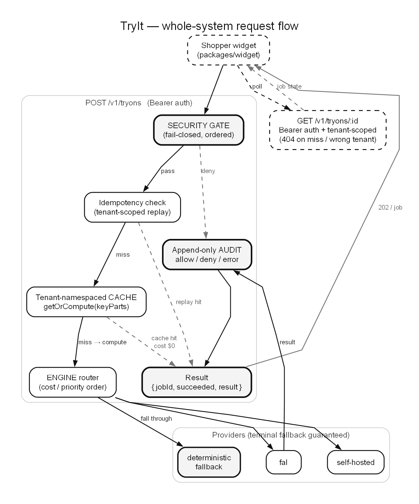

*The end-to-end request flow — authenticate → rate/budget check → cache lookup → engine provider
fall-through → validate → audit → respond. [interactive](evidence/diagrams/00_whole_system_request_flow.html)*

### Components

Each component is a single-responsibility unit with its own diagram (black-and-white, exported as
PNG + interactive HTML).

| | Component | Interactive |
| --- | --- | --- |
| 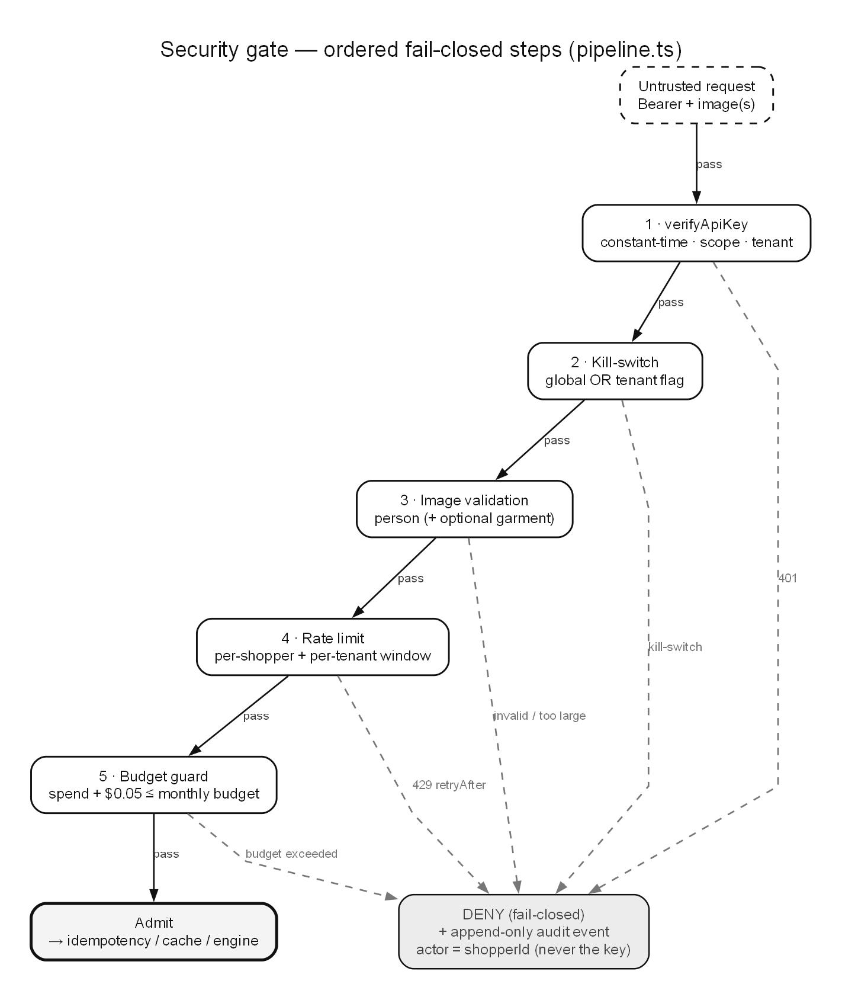 | **Security gate** — bearer extraction, hashed-key verification, tenant scoping, rate-limit + budget + kill-switch, all fail-closed. | [interactive](evidence/diagrams/01_security_gate.html) |
| 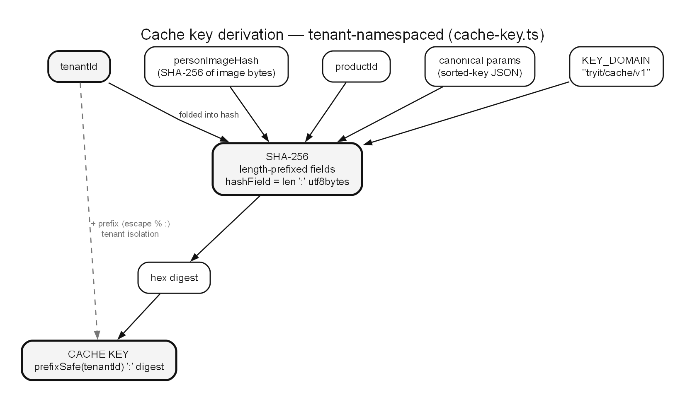 | **Cache-key derivation** — content-addresses the (person, garment, params) tuple into a tenant-namespaced key so identical requests dedupe and tenants stay isolated. | [interactive](evidence/diagrams/02_cache_key_derivation.html) |
| 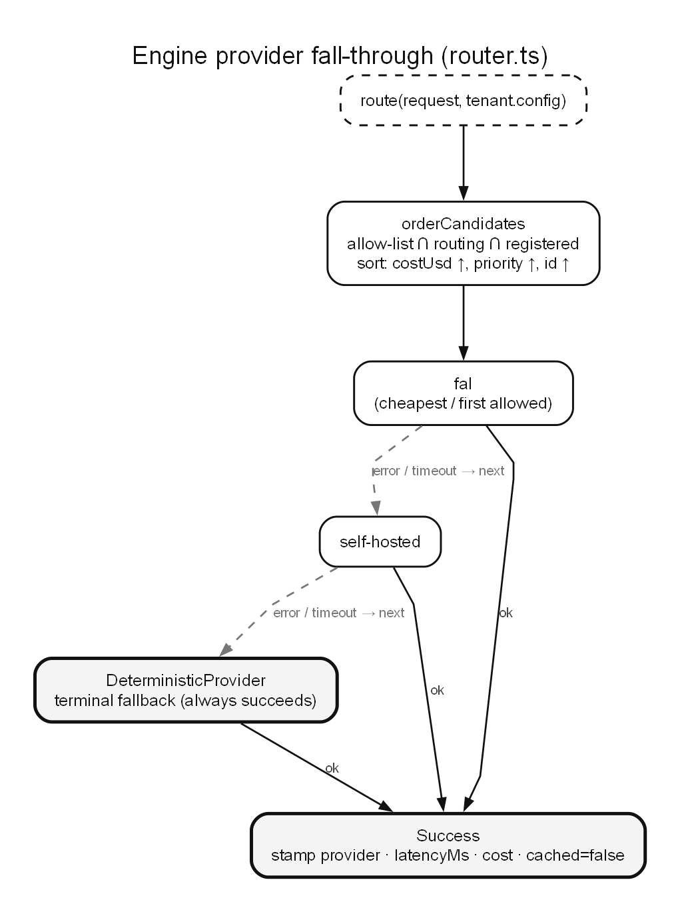 | **Engine provider fall-through** — tries providers in order (fal.ai → self-hosted → deterministic), validating each result before accepting it; never dead-ends. | [interactive](evidence/diagrams/03_engine_provider_fallthrough.html) |
| 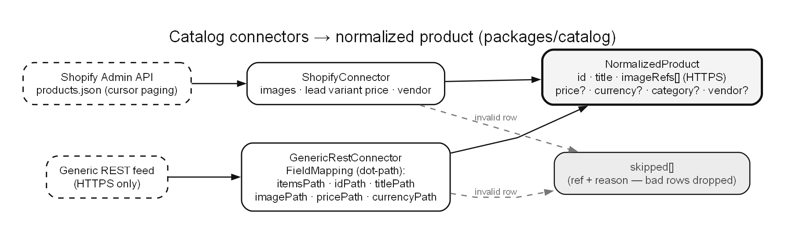 | **Catalog connectors** — resolve a `productId` to a garment image via Shopify or a generic REST source. | [interactive](evidence/diagrams/04_catalog_connectors.html) |
| 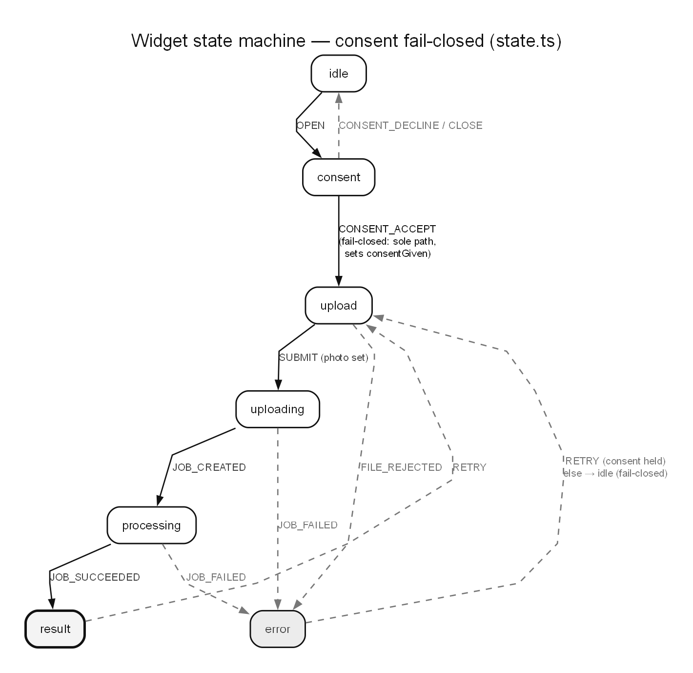 | **Widget state machine** — the browser FSM (consent → upload → polling → result/error); network orchestration lives in the host glue, never the element. | [interactive](evidence/diagrams/05_widget_state_machine.html) |
| 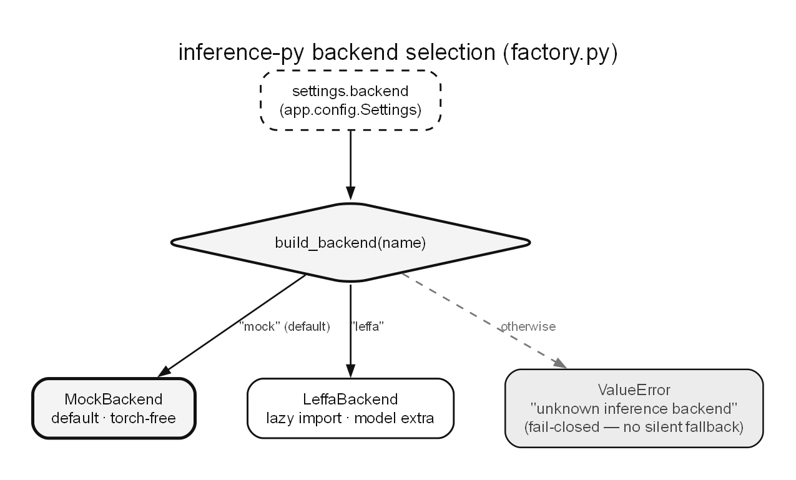 | **Inference backend selection** — the Python service picks CatVTON / Leffa / fallback for the self-hosted try-on path. | [interactive](evidence/diagrams/06_inference_py_backend_selection.html) |

---

## Proof / Evidence

TryIt treats the test suite as the evidence. The full showcase — peer-reviewed-standard stats,
graphs, and flow diagrams — lives in [`evidence/`](evidence/).

### The suite is the evidence — 755 automated tests

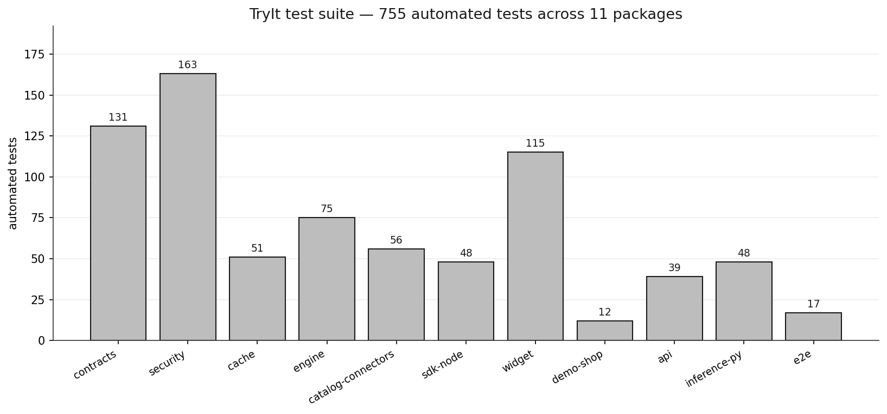

**755 automated tests** across 11 suites (vitest for the TypeScript packages, pytest for the
Python service, Playwright for the browser E2E). They are adversarial, boundary-exact,
property-based, and fuzzed — not happy-path. [interactive](evidence/graphs/test_counts_per_package.html)

### Coverage clears the gate everywhere

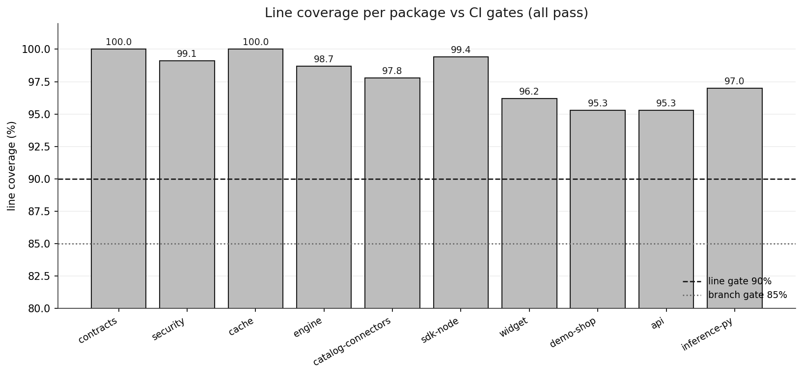

Every covered package reports **~95–100% line coverage**, comfortably above the CI gate of
**line ≥ 90% / branch ≥ 85%**. Coverage is necessary, not sufficient — which is why the real
acceptance signal is the mutation score. [interactive](evidence/graphs/coverage_per_package.html)

> **Mutation testing has teeth.** Stryker injects faults and confirms the tests *kill* them.
> Measured scores: **security 92.46%**, **cache 94.41%**, **contracts 86.39%**, **engine 77.06%**
> (over covered mutants). See [`docs/mutation-testing.md`](docs/mutation-testing.md).

### Microsecond-fast on the deterministic path

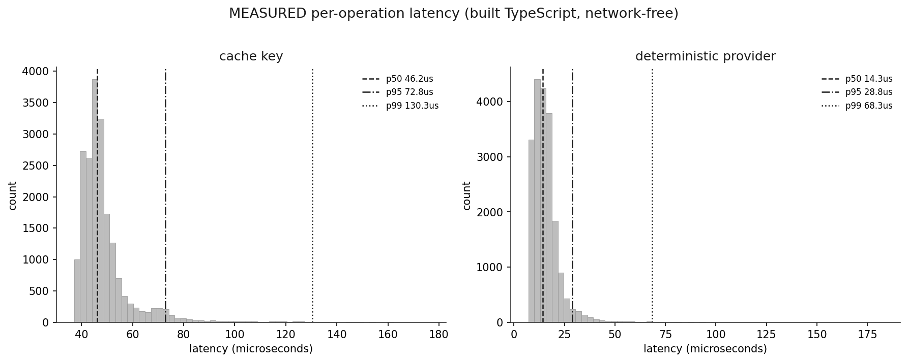

Measured over 20,000 runs: the **deterministic provider** returns at a **p50 of ~14 µs**
(p95 ~29 µs), and **cache-key derivation** runs at a **p50 of ~46 µs** (p95 ~73 µs). The hot path
that gates cost is effectively free. [interactive](evidence/graphs/latency_distribution.html)

### Caching is the economic argument

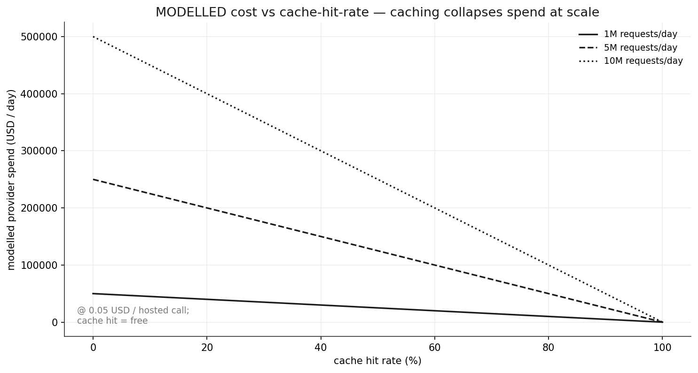

At **10M requests/day** with a hosted provider at **$0.05/call**, a 0% cache hit rate costs
**~$500k/day**. At an **80% hit rate**, cost drops to **~$100k/day** — a **5× reduction** — because
cache hits are free and microsecond-fast. Content-addressed caching is not a nicety; it is the
difference between viable and not. [interactive](evidence/graphs/cost_vs_cache_hit_rate.html)

---

## Quickstart

### 1. Hosted API

Create a try-on with a Bearer key. The request carries the shopper's person image (HTTPS-only) and
a `productId`; the response is a typed job with the result image.

```bash
# Create a try-on
curl -X POST https://api.tryit.example/v1/tryons \
  -H "Authorization: Bearer $TRYIT_API_KEY" \
  -H "Content-Type: application/json" \
  -H "Idempotency-Key: order-4821" \
  -d '{
    "tenantId": "acme",
    "shopperId": "shopper-123",
    "productId": "tshirt-blue-m",
    "category": "apparel",
    "personImage": { "kind": "url", "url": "https://cdn.example.com/shopper.jpg" }
  }'
# -> { "jobId": "job_…", "status": "succeeded",
#      "result": { "resultImageUrl": "https://…", "cached": false, "latencyMs": …, "costUsd": … } }

# Retrieve / poll a job by id (tenant-scoped; an unknown or foreign id returns 404)
curl https://api.tryit.example/v1/tryons/job_… \
  -H "Authorization: Bearer $TRYIT_API_KEY"
```

> The `Idempotency-Key` header makes retries safe: the same (tenant, key) returns the prior job
> instead of re-running — and re-charging — the provider.

Prefer typed Node? Use the SDK:

```ts
import { TryItClient } from '@tryit/sdk-node';

const client = new TryItClient({
  apiKey: process.env.TRYIT_API_KEY!, // sent only as a Bearer token
  baseUrl: 'https://api.tryit.example',
});

const job = await client.createTryOn({
  tenantId: 'acme',
  shopperId: 'shopper-123',
  productId: 'tshirt-blue-m',
  personImage: { kind: 'url', url: 'https://cdn.example.com/shopper.jpg' },
});

const done = await client.waitForJob(job.jobId, { pollMs: 1000, timeoutMs: 60_000 });
console.log(done.status, done.result?.resultImageUrl);
```

### 2. Embeddable widget

Drop the loader script onto a product page and mark a host element with `data-tryit-mount` plus the
`data-*` config. The loader auto-mounts on `DOMContentLoaded`, wires the create → poll → render
lifecycle, and enforces the consent gate — no hand-written network code.

```html
<!-- Product page -->
<div
  data-tryit-mount
  data-api-base="https://api.tryit.example"
  data-publishable-key="pk_live_…"
  data-tenant-id="acme"
  data-shopper-id="shopper-123"
  data-product-id="tshirt-blue-m"
  data-product-image="https://cdn.example.com/shopper.jpg"
></div>

<script type="module" src="https://cdn.tryit.example/widget/embed.js"></script>
```

The loader exposes `window.TryIt = { mount, mountAll }` for programmatic mounting. If a required
`data-*` attribute is missing, the loader **fails closed** and refuses to mount a broken widget.

For **React / Next.js**, the underlying `<tryit-widget>` Web Component registers itself on import —
import it **dynamically** so it never runs during SSR:

```tsx
import { useEffect, useRef } from 'react';

export function TryItWidget() {
  const ref = useRef<HTMLElement>(null);
  useEffect(() => {
    void import('@tryit/widget'); // client-only: registers <tryit-widget>, SSR-safe
  }, []);
  return <tryit-widget ref={ref} />;
}
```

### 3. Self-host

Bring up the whole stack — API, Python inference service, Redis, and the demo shop — with Docker
Compose:

```bash
docker compose -f infra/docker-compose.yml up
# API on :3001, inference on :8000, demo shop on :3000
```

See [`docs/self-hosting.md`](docs/self-hosting.md) for environment variables, the kill-switch, and
the self-hosted CatVTON / Leffa inference path.

### Local development

```bash
pnpm install        # install the workspace
pnpm test           # run the full suite (vitest + pytest + Playwright)
pnpm build          # build all packages
```

---

## Security

Security and compliance are **defaults, not afterthoughts**. Every trust boundary fails closed.

- **Fail-closed posture.** A missing credential, ambiguous permission, or unparseable input is
  *refused*, never guessed — the API never echoes the request body, the key, or an internal error.
- **Authentication.** API keys are stored **hashed**, verified per request, and every job is
  **tenant-scoped** — a caller can never read another tenant's job (an unknown *or* foreign id both
  return an indistinguishable 404, defeating enumeration).
- **Rate limits + budget guard + kill-switch.** Per-tenant request limits with `Retry-After`
  back-off, a per-tenant spend ceiling, and a single config flag that halts all external calls.
- **Image validation.** Image refs are **HTTPS-only** (no `http:` / `data:` / `file:` SSRF
  vectors); inline base64 images are MIME-allow-listed and length-bounded; result URLs must be
  HTTPS or a safe, bounded inline data-URL.
- **Append-only audit log.** Every sensitive action and external call is recorded — what, when, who.

Full STRIDE analysis and controls: [`docs/threat-model.md`](docs/threat-model.md).

---

## Docs & research

| Area | Link |
| --- | --- |
| Integration guide | [`docs/integration-guide.md`](docs/integration-guide.md) |
| API reference | [`docs/api-reference.md`](docs/api-reference.md) |
| Self-hosting | [`docs/self-hosting.md`](docs/self-hosting.md) |
| Threat model (STRIDE) | [`docs/threat-model.md`](docs/threat-model.md) |
| Mutation testing | [`docs/mutation-testing.md`](docs/mutation-testing.md) |
| Design system | [`docs/design/`](docs/design/) — brief, tokens, component inventory, flows |
| Evidence showcase | [`evidence/`](evidence/) — graphs, diagrams, benchmarks, validation |

**Research** ([`docs/research/`](docs/research/)) — the method space was surveyed from primary
sources before committing to an approach:

- [VITON-HD](docs/research/viton-hd/) · [IDM-VTON](docs/research/idm-vton/) ·
  [OOTDiffusion](docs/research/ootdiffusion/) · [CatVTON](docs/research/catvton/) ·
  [Leffa](docs/research/leffa/)
- [Method-space survey](docs/research/method-space-survey.md) ·
  [Provider survey](docs/research/provider-survey.md) ·
  [**Decision**](docs/research/decision.md) — why the chosen approach won.

---

## Repository structure

```
TryIt/
├── apps/
│   ├── api/                 Next.js App Router REST API (/v1/tryons, /v1/health)
│   └── demo-shop/           reference storefront integrating the widget
├── packages/
│   ├── contracts/           typed wire contracts (Zod) — the source of truth
│   ├── security/            auth, tenant scoping, rate limit, budget, kill-switch
│   ├── cache/               content-addressed, tenant-namespaced result cache
│   ├── engine/              provider fall-through + result validation
│   ├── catalog-connectors/  Shopify + generic REST garment resolution
│   ├── sdk-node/            typed Node client (TryItClient)
│   └── widget/              embeddable Web Component + embed loader
├── services/
│   └── inference-py/        self-hosted CatVTON / Leffa inference service (Python)
├── e2e/                     Playwright browser end-to-end suite
├── infra/                   docker-compose, terraform, heartbeats
├── docs/                    guides, API reference, threat model, research, design
└── evidence/                graphs, B&W diagrams, benchmarks, validation
```

---

## Contributing

Contributions are welcome. The bar is non-negotiable and enforced in CI:

- **Tests with teeth.** New behaviour ships with adversarial / property-based / boundary-exact
  tests in the same change; bug fixes start with a failing regression test. A green suite of
  trivial tests is not acceptance — the **mutation score** is.
- **Gates.** CI fails below **line ≥ 90% / branch ≥ 85%** coverage, on any lint error, and on any
  failing test across the workspace.
- **Fail-closed by default.** Never weaken a security control to make a test pass.

Run the full suite locally with `pnpm test` before opening a PR.

---

## License

[MIT](LICENSE) © TryIt contributors.
