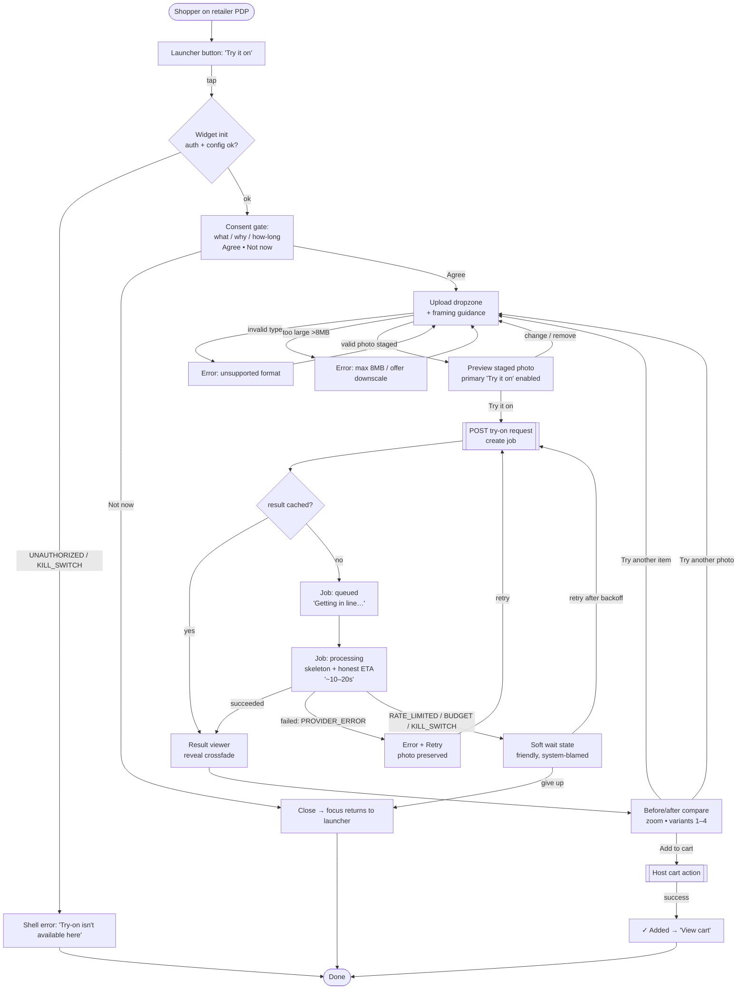
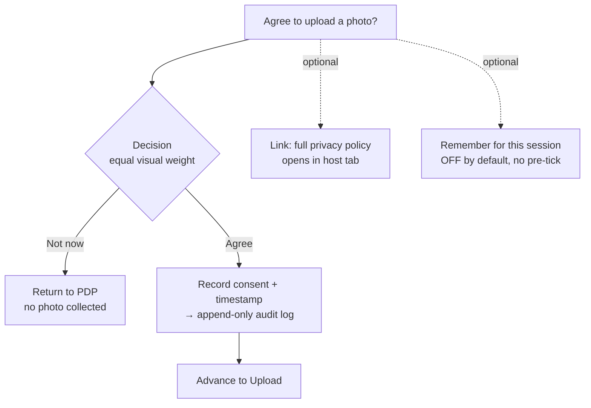
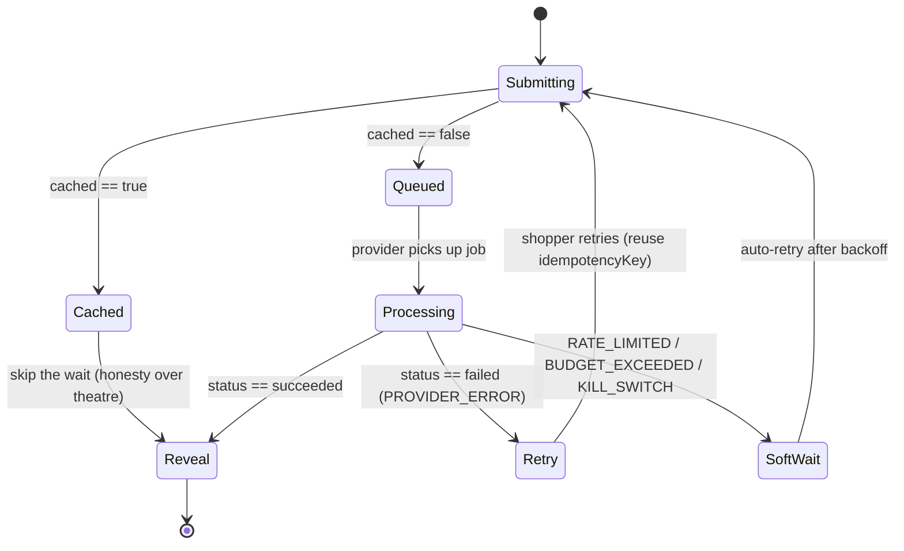
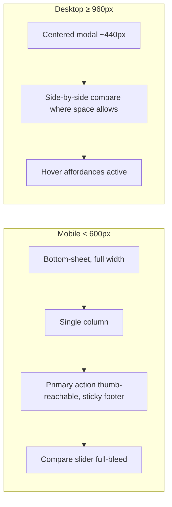

# TryIt — Shopper Flows

> **Owner:** CDO / Head of Design. The end-to-end shopper journey through the embeddable widget, screen by screen and state by state, built around the **real async job lifecycle** (`queued → processing → succeeded | failed`) and the **seven contract error codes** in `packages/contracts`. Every path here is wired to real-shaped data — nothing static (`design-brief.md` §1, §3.8).
> **Companions:** [`design-brief.md`](./design-brief.md) · [`design-tokens.md`](./design-tokens.md) · [`component-inventory.md`](./component-inventory.md)

---

## 1. The happy path (one line)

**Launcher → Consent → Upload → (Confirm) → Processing → Result + Compare → Add to cart → Done.**

The consent and processing moments are first-class, designed screens (not interstitials), because they are where trust is won or lost.

---

## 2. End-to-end flow (primary)

---

## 3. The consent / privacy moment (expanded)

The single most important screen. Selfies are sensitive PII; the README/threat-model posture is **process-then-purge, encrypt in transit + at rest, never train, never share**. The UI must make that legible *before* the upload (just-in-time, not buried).

**Copy contract** (humane, plain, brief §6):
- *What:* "We'll use one photo of you to create a try-on preview."
- *Why:* "So you can see how this item looks on you before buying."
- *How long / safety:* "Your photo is used only for this preview, then deleted. We never use it to train AI, and we never share it."
- *Buttons:* primary **"I agree — continue"**, secondary **"Not now"** — equal weight, no dark pattern.

**Edge:** if the consent record can't persist, proceed only in-memory for the session and still honor purge — never silently assume consent.

---

## 4. The processing / async-inference experience (expanded)

Generative inference is **not instant** — the contract's job lifecycle proves it. We *respect the wait* rather than hide it (brief §3.4). This is a differentiation opportunity: the research found that even the category leaders publish weak wait-state UX.

**Design rules for the wait:**
- **Layout-mirroring skeleton** in the exact shape of the coming result — not a spinner (NN/g skeleton-screen principle).
- **Honest ETA** ("usually ~10–20s"); **indeterminate** progress (never a fabricated percentage).
- **Reassurance line** that the photo is used only for this preview.
- **Cached fast-path:** when `cached === true`, go straight to the reveal — no fake wait.
- **Reduced motion:** static skeleton + text status; **screen reader:** `aria-live` announces "Creating your preview" → "Your preview is ready".
- **No infinite spin:** after a threshold, escalate to a calm "still working" message; a true timeout routes to Error + Retry.

---

## 5. Failure & edge matrix (every `errors.ts` code → recovery)

| Trigger | Code | Where it surfaces | Shopper sees | Recovery |
| --- | --- | --- | --- | --- |
| Wrong file type | `INVALID_INPUT` | Dropzone (client-side) | "Use a JPG, PNG, or WebP" | Re-upload (photo not lost) |
| File > 8MB | `PAYLOAD_TOO_LARGE` | Dropzone (client-side) | "Max 8MB — try a smaller photo" | Re-upload / offer downscale |
| Bad credentials / misconfig | `UNAUTHORIZED` | Shell, at init | "Try-on isn't set up here" | Close; logged for retailer |
| Per-shopper/tenant rate hit | `RATE_LIMITED` | Soft wait | "We're popular right now — try again shortly" | Auto-retry after backoff countdown |
| Tenant spend cap reached | `BUDGET_EXCEEDED` | Soft wait | "Try-on is taking a break here" | Graceful dead-end, Close |
| Global/tenant kill-switch | `KILL_SWITCH_ENGAGED` | Shell or soft wait | "Temporarily unavailable" | Close / try later |
| Upstream provider failed | `PROVIDER_ERROR` | Processing → Error+Retry | "We hit a snag — let's try again" | Retry (reuse idempotency key) |
| Result image won't load | (client) | Result viewer | "Couldn't load your preview" | Re-fetch signed URL |
| No clear subject in photo | (validation hint) | Dropzone / after submit | "Couldn't find a clear, full-length subject" | Re-upload, non-blaming |
| Shopper closes mid-flow | (client) | Close guard | "Discard your photo?" | Confirm → **purge** staged photo |

**Universal rules:** errors are **non-blaming** (system-blamed where true), **never color-only** (icon + text + tone token), the **staged photo is preserved** on retryable errors, and a **staged photo is purged** on dead-ends/close (process-then-purge).

---

## 6. Responsive behavior across the flow

- The flow's **steps and states are identical** across breakpoints; only layout/affordances adapt (`design-tokens.md` §8).
- Light + dark themes both fully designed; theme is host-driven or `prefers-color-scheme`.

---

## 7. What "done" looks like for these flows

Every node and edge above is **exercised by the live Playwright E2E suite** in a real browser — happy path **and** every failure/edge path — asserting the real action fires and the right end state is reached, across Chromium / WebKit / Firefox, light + dark, mobile + desktop (`design-brief.md` §7, `claude.md` §4.9). A path that exists in this doc but isn't clickable-and-tested in the running widget is not done.
