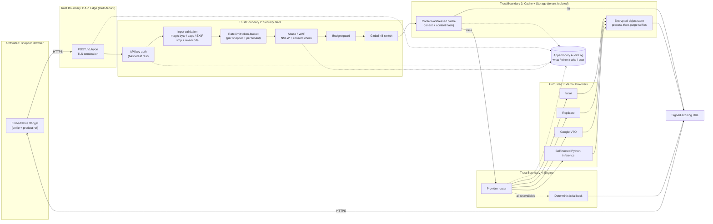

# TryIt — STRIDE Threat Model

**System:** TryIt — open-source, multi-tenant virtual try-on (VTO) platform.
**Owner:** CTO.
**Standard:** Grounded in `CLAUDE.md` §5.6 (Security by Default). Security and compliance are defaults, not afterthoughts. **Fail closed everywhere.**
**Scope:** The end-to-end request flow from the embeddable widget through the API edge, security gate, cache/storage, engine, and external try-on providers.
**Status:** Living document — update on every design change (per §5.6).

---

## 1. System Overview

A shopper interacts with an **embeddable widget** in a merchant's storefront. The widget uploads a selfie and a product reference to a **multi-tenant API** (`POST /v1/tryon`). Every request passes a **security gate** before any compute is spent. On a cache miss, the **engine** routes to a pluggable `TryOnProvider`. The result is returned as a **signed, expiring URL**. Every step writes to an **append-only audit log** (what / when / who / cost).

**Selfies are sensitive PII.** They are processed-then-purged with configurable retention, encrypted in transit and at rest. **Multi-tenancy is enforced in the data layer, not by convention** — one tenant's data must be unreachable from another's.

### Request flow

1. Widget → `POST /v1/tryon` (selfie + product ref + tenant-scoped API key).
2. **Security gate:** per-tenant API key auth (hashed at rest); input validation (image magic-byte sniff, size/dimension caps, EXIF strip + re-encode); rate-limit token-bucket (per shopper + per tenant); abuse/WAF (NSFW + consent check); budget guard; global kill-switch.
3. **Cache:** content-addressed lookup (keyed by tenant + content hash).
4. On miss → **Engine** routes to a `TryOnProvider` (fal.ai default; Replicate / Google VTO; self-hosted Python inference; deterministic fallback).
5. Result image → **signed expiring URL** returned to widget.
6. **Audit log** appended at every step (what / when / who / cost).

### Trust-boundary diagram

**Trust boundaries (where data crosses a privilege change and must be re-validated):**

- **TB1 Browser → API edge:** all widget input is untrusted (file uploads, headers, tenant claims).
- **TB2 API edge → Security gate:** no request reaches compute or storage until it clears the gate.
- **TB3 Gate → Cache/Storage:** every read/write is scoped by `tenant_id` in the data layer.
- **TB4 Engine → external providers:** providers are untrusted third parties; outbound data is minimised and provider responses are validated.
- **TB5 Audit log:** integrity-critical sink, append-only, written from every component.

---

## 2. Data Classification

| Data asset | Classification | Handling requirement |
| --- | --- | --- |
| **Selfie images** | **Sensitive PII (biometric-adjacent)** | Encrypt in transit + at rest; **process-then-purge** with configurable retention; never logged; never sent to a provider beyond the minimum; consent required. |
| **Generated try-on result** | Sensitive (derived from PII) | Encrypt at rest; served only via signed expiring URL; same retention as source selfie. |
| **Product images** | Public | Integrity-checked; cacheable; no confidentiality requirement. |
| **Per-tenant API keys** | **Secret** | Stored **hashed** at rest; supplied via env / secret-manager; never in logs, URLs, or client code. |
| **Provider API keys (fal.ai / Replicate / Google)** | **Secret** | Env / secret-manager only; least-privilege; rotatable; never exposed to widget or tenant. |
| **Audit log** | **Integrity-critical** | Append-only, immutable, tamper-evident; retained per compliance; access-restricted. |
| **Cache index / content hashes** | Internal | Tenant-namespaced; no cross-tenant key collision. |
| **Cost / budget counters** | Integrity-critical | Authoritative for budget guard and billing; tamper-resistant. |

---

## 3. STRIDE Analysis

Each table lists threats specific to TryIt, the mitigating control, and the **enforcing component**. All controls **fail closed** (§5.6).

### 3.1 Spoofing (authenticity)

| # | Threat | Mitigating control | Enforced at |
| --- | --- | --- | --- |
| S1 | Caller impersonates a tenant with a stolen/guessed API key | Per-tenant API keys, high-entropy, **hashed at rest** (constant-time compare); rotation supported; deny on mismatch | Security gate — Auth |
| S2 | Widget origin spoofed to borrow another merchant's quota | Bind key to allowed origins/referrer + signed widget config; reject mismatched origin | API edge + Auth |
| S3 | Shopper forges another shopper's identity to bypass per-user limits | Token-bucket keyed on server-derived shopper id (not client-asserted); unauthenticated requests denied | Security gate — Rate-limit |
| S4 | Attacker spoofs a provider response to inject a malicious result image | Outbound to providers over TLS with pinned/verified endpoints; validate response content-type + magic bytes before storage | Engine |
| S5 | Forged signed result URL to read another user's image | URLs signed with server secret, scoped to object + expiry; signature verified on fetch | Cache/Storage |

### 3.2 Tampering (integrity)

| # | Threat | Mitigating control | Enforced at |
| --- | --- | --- | --- |
| T1 | **Cross-tenant cache poisoning** — attacker crafts input so its result is served to another tenant | Cache key = `hash(tenant_id ‖ normalised_content)`; tenant namespace in key; no global content keys | Cache |
| T2 | **Malicious/polyglot upload** — file pretends to be an image (magic-byte mismatch, embedded payload) | Magic-byte sniff (reject on mismatch), size + dimension caps, **decode + re-encode** to strip embedded content, EXIF strip | Security gate — Validation |
| T3 | Tampering with cost/budget counters to exceed spend | Counters server-authoritative, atomic increments, append-only audit of cost | Budget guard + Audit |
| T4 | Audit-log tampering to hide abuse | **Append-only, immutable** store; tamper-evident (hash-chained); restricted write path | Audit log |
| T5 | Man-in-the-middle altering selfie/result in transit | TLS in transit end-to-end; content hash verified at storage | API edge + Storage |
| T6 | Provider returns altered/oversized payload | Validate provider output (type, size, dimensions) before caching/serving | Engine |

### 3.3 Repudiation (non-repudiation)

| # | Threat | Mitigating control | Enforced at |
| --- | --- | --- | --- |
| R1 | Tenant denies authorising a costly batch of generations | **Append-only audit log** records who / what / when / **cost** per request, keyed to tenant + key id | Audit log (all components) |
| R2 | Shopper denies consent to process their selfie | Consent capture logged with timestamp before processing; no consent → refuse | Security gate — WAF/consent + Audit |
| R3 | Disputed billing / cost reconciliation | Per-request cost recorded immutably at engine dispatch; reconciles to provider invoices | Budget guard + Audit |
| R4 | Operator denies invoking kill-switch / config change | Privileged actions audited with actor identity | Audit log |

### 3.4 Information Disclosure (confidentiality)

| # | Threat | Mitigating control | Enforced at |
| --- | --- | --- | --- |
| I1 | **Selfie exfiltration** via cross-tenant read or stale storage | Data-layer tenant isolation; **process-then-purge** + configurable retention; encryption at rest; signed expiring URLs only | Cache/Storage |
| I2 | **Provider key leakage** to widget, logs, or tenant | Provider keys in secret-manager, server-side only; never returned to client; scrubbed from logs/errors | Engine + secret-manager |
| I3 | Tenant API key leakage via logs/URLs | Keys hashed at rest; never logged; not placed in query strings | Auth + logging policy |
| I4 | EXIF GPS / device metadata leaks shopper location | **EXIF strip + re-encode** on ingest | Security gate — Validation |
| I5 | Signed URL guessing / over-long TTL exposes results | Short expiry, unguessable signature, object-scoped; revoke on purge | Cache/Storage |
| I6 | Over-sharing selfie with external provider | Minimise outbound payload; deterministic fallback for low-trust contexts; provider selection per tenant policy | Engine |
| I7 | Verbose errors leak internal paths/keys | Generic client errors; details only to audit/internal logs (no secrets) | API edge |

### 3.5 Denial of Service (availability)

| # | Threat | Mitigating control | Enforced at |
| --- | --- | --- | --- |
| D1 | **Cost-exhaustion DoS** — flood of paid generations drains tenant budget | **Budget guard** caps spend per tenant; cache short-circuits repeats; deny over budget | Budget guard + Cache |
| D2 | **Rate-limit evasion via key rotation / multi-key** | Token-bucket per tenant **and** per shopper; tenant-level aggregate cap independent of key count | Security gate — Rate-limit |
| D3 | Upload bomb (huge / decompression-bomb images) | Size + dimension caps enforced **before** decode; bounded re-encode | Security gate — Validation |
| D4 | Provider outage cascades to full failure | Multi-provider routing + **deterministic fallback**; circuit-break failing providers | Engine |
| D5 | Platform-wide abuse / incident | **Global kill-switch** halts all external calls (fail closed) | Security gate — Kill-switch |
| D6 | Amplification via cache misses on adversarial unique inputs | Per-shopper bucket + budget guard bound miss volume; abuse scoring | Rate-limit + WAF |

### 3.6 Elevation of Privilege (authorisation)

| # | Threat | Mitigating control | Enforced at |
| --- | --- | --- | --- |
| E1 | Tenant A reads/writes Tenant B's cache, storage, or audit data | **Multi-tenant isolation enforced in the data layer**, not by convention; every query scoped by `tenant_id` | Cache/Storage data layer |
| E2 | **Prompt / file injection via uploaded image** to manipulate the provider pipeline | Treat all upload as untrusted; re-encode to pixels (strips embedded prompts/metadata); no untrusted text passed to provider; output validated | Validation + Engine |
| E3 | Shopper escalates to tenant/admin scope | Least-privilege scoped credentials per component; no shared god-key; deny by default | Auth + IAM |
| E4 | **Deepfake / abuse of others' photos without consent** (non-consensual try-on of a third party) | NSFW + **consent check** at WAF; refuse without consent; abuse logged; reportable | Security gate — WAF/consent |
| E5 | Engine over-privileged (can reach other tenants' stores) | Engine runs with narrow, request-scoped credentials issued post-gate | Engine + IAM |
| E6 | Compromised provider escalates into platform | Providers isolated behind engine; outbound-only; no inbound trust; minimal data | TB4 boundary |

---

## 4. Controls Matrix — `CLAUDE.md` §5.6 → TryIt

| §5.6 control | TryIt implementation | Enforced where |
| --- | --- | --- |
| **Validate input, encode output, deny by default** | Magic-byte sniff, size/dimension caps, EXIF strip + re-encode; unknown/invalid → reject; generic encoded error output | Security gate — Validation; API edge |
| **Secrets via env / secret-manager** | Tenant keys hashed at rest; provider keys in secret-manager, server-side only; pre-commit secret scanning | Auth; secret-manager; CI |
| **Least privilege** | Per-component, request-scoped credentials; engine and storage get only their own scoped access; no shared god-key | IAM across components |
| **Encryption at rest + in transit** | TLS end-to-end; selfies + results encrypted at rest (customer-managed keys where applicable) | API edge; Storage |
| **Fail closed** | Missing/ambiguous auth, consent, budget, or permission → **refuse**; kill-switch defaults to halt | Every gate stage |
| **Append-only audit log** | Immutable, hash-chained what/when/who/cost on every request and privileged action | Audit log |
| **Untrusted-input / injection defence** | All uploads untrusted; decode-and-re-encode strips embedded payloads/prompts; no untrusted text to providers; minimal outbound data | Validation; Engine; TB4 |
| **Dependency scan + SAST + DAST in CI** | CI fails on any high/critical finding; provider SDKs pinned and scanned | CI pipeline |
| **Kill-switch** | Single global flag halts all external/provider calls | Security gate — Kill-switch |
| **Multi-tenant isolation in the data layer** | Cache keys and storage queries namespaced/scoped by `tenant_id`; cross-tenant access structurally impossible, not policy-only | Cache/Storage data layer |

---

## 5. Residual Risks, Assumptions & Fail-Closed Statement

### Assumptions

- TLS, secret-manager, and the encrypted object store are correctly provisioned and patched (platform responsibility).
- External providers (fal.ai, Replicate, Google VTO) honour their stated data-handling and deletion terms; TryIt minimises what it sends but cannot fully control downstream retention.
- The audit log's underlying store enforces immutability at the infrastructure level.
- Consent captured at the widget reflects the actual subject of the selfie (TryIt verifies presence of consent, not its truthfulness — see residual R2 below).

### Residual risks

| Risk | Why it remains | Mitigation / monitoring |
| --- | --- | --- |
| Downstream provider retention of selfies beyond TryIt's purge | Outside TryIt's runtime control | Contractual terms; minimise payload; prefer self-hosted/deterministic for high-sensitivity tenants |
| Consent attestation can be falsified by a malicious shopper | Cannot biometrically prove subject == uploader | NSFW/abuse scoring, rate limits, takedown + report path, audit trail |
| Sophisticated decompression/codec exploits in image libraries | Zero-day in decode path | Bounded resource limits, sandboxed decode, dependency scanning, kill-switch |
| Cache-timing side channels revealing whether content was previously generated | Inherent to content-addressed caching | Per-tenant namespacing limits blast radius; monitor anomalous miss/hit patterns |
| Provider key compromise at the provider side | Third-party breach | Key rotation, least-privilege provider keys, spend caps per provider |

### Fail-closed statement (binding)

**When any permission, key, consent, budget check, or validation is missing, ambiguous, or fails, TryIt refuses the action rather than proceeding** (`CLAUDE.md` §5.6). Specifically: no API key match → reject; no/invalid consent → reject; over budget or over rate limit → reject; image fails magic-byte/size/dimension validation → reject; all providers unavailable → deterministic fallback or reject (never an unbounded retry storm); the **global kill-switch defaults to halting all external calls**. No security or compliance control is ever weakened or disabled to make a test pass.

---

*Threat model maintained by the CTO. Review and update on every architectural change.*
